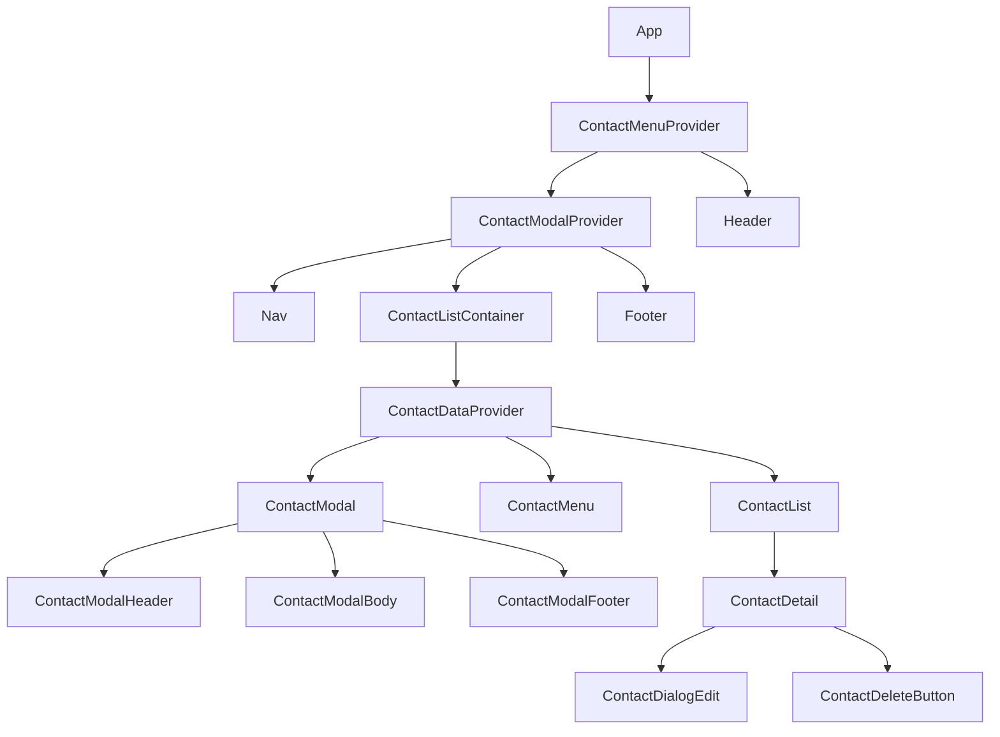

# My Next App

This project is a contact management application built with Next.js, TypeScript, and Prisma. It allows users to add,
edit, and delete contacts.

## Project Structure

The project is structured into several directories and files, each serving a specific purpose:

- `src/app`: This directory contains the main application components.
- `src/contexts`: This directory contains the React context providers used for state management.
- `src/hooks`: This directory contains custom hooks used in the application.
- `src/lib`: This directory contains utility functions and the Prisma client for database operations.

## Application Flow

The application is primarily composed of the following components:

- `ContactListContainer`: This is the main container component that fetches the contact list data and provides it to the
  child components. It uses the `getContactListDataFromAction` function to fetch the contact data.
- `ContactList`: This component receives the contact list from the `ContactListContainer` and displays each contact. It
  uses the `useContactSortAndFilter` hook to sort and filter the contact list based on the user's input.
- `ContactDetail`: This component receives individual contact data and displays it. It also includes `ContactDialogEdit`
  and `ContactDeleteButton` components for editing and deleting the contact, respectively.
- `ContactDialogEdit` and `ContactDialogAdd`: These components are used to display a modal for editing an existing
  contact or adding a new one. They use the `useContactModalContext` hook to manage the modal state.
- `ContactDeleteButton`: This component is used to delete a contact. It uses the `useContactDataContext` hook to call
  the `deleteContact` function.

## State Management

State management in this application is handled using React Context. There are two main context providers:

- `ContactDataProvider`: This provider is used to manage the state of the contact list. It provides functions for
  creating, updating, and deleting contacts.
- `ContactMenuProvider`: This provider is used to manage the state of the search text input in the `ContactMenu`
  component.

## Database Operations

Database operations are performed using Prisma. The `src/lib/prisma/contact-data-repo.ts` file contains functions for
fetching, creating, updating, and deleting contacts in the database.

In this project, the React Context API is used for state management across multiple components. There are two main
context providers:

1. `ContactDataProvider`: This provider is used to manage the state of the contact list. It provides functions for
   creating, updating, and deleting contacts. The state and functions are consumed in various components
   like `ContactListContainer`, `ContactDetail`, `ContactDeleteButton`, `ContactDialogEdit`, and `ContactDialogAdd`.

2. `ContactMenuProvider`: This provider is used to manage the state of the search text input in the `ContactMenu`
   component. The state is consumed in the `ContactMenu` and `ContactList` components.

3. `ContactModalProvider`: This provider is used to manage the state of the contact modal. It provides the state and
   functions to handle the modal's show/hide status and the contact details in the modal. The state and functions are
   consumed in various components
   like `ContactModal`, `ContactModalHeader`, `ContactModalBody`, `ContactModalFooter`, `ContactDialogEdit`,
   and `ContactDialogAdd`.

The Context API provides a way to pass data through the component tree without having to pass props down manually at
every level. In this project, it's used to share common data across multiple components, making the state management
more efficient and the code cleaner.

## Running the Application

To run the application, use the following commands:

- `npm install`: Install the project dependencies.
- `npm run dev`: Start the development server.

## Contributing

When contributing to this project, please ensure that your changes do not break the existing functionality. Add comments
to your code where necessary and follow the existing coding style.

## License

This project is open source and available under the [MIT License](LICENSE).